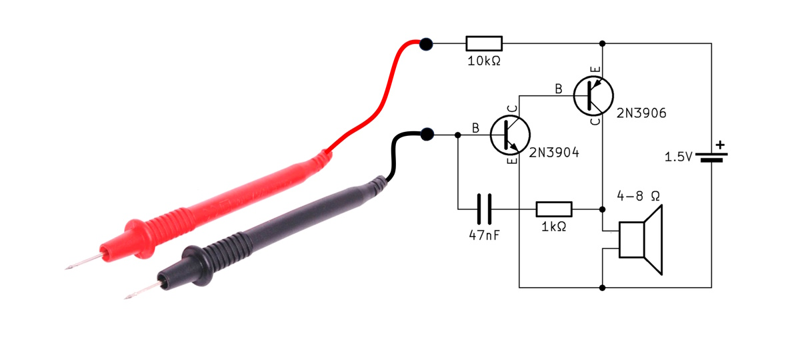

# Description

This sub-Dollar pocket-sized continuity tester provides instant audio feedback which is very convenient to check your circuits. 
The pitch of the tone indicates the resistance: a higher tone means lower resistance. 
The video below shows the tester in action, how to build it in 15 minutes and an explanation how it works!

# Check out the video:

# "Schematic" of the continuity tester:  

# Files:  
  
An LTSpice simulation of the circuit is included.  
